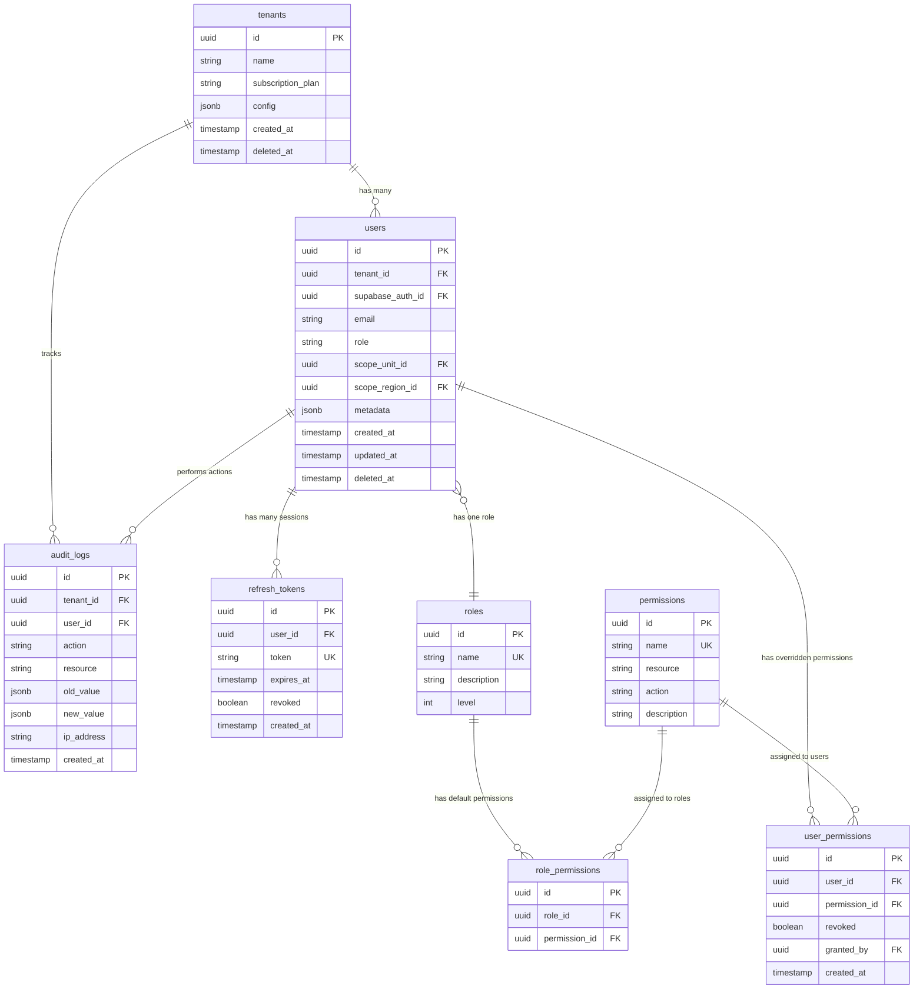

# 🗄️ Database Schema - Gizi Platform Auth System

> **Version**: 1.0.0  
> **Last Updated**: 2025-12-28  
> **Database**: PostgreSQL 15+ (Supabase)  
> **ORM**: Drizzle

---

## 📋 Table of Contents

1. [Schema Overview](#schema-overview)
2. [Entity Relationship Diagram](#entity-relationship-diagram)
3. [Table Specifications](#table-specifications)
4. [Indexes & Performance](#indexes--performance)
5. [Data Migration Strategy](#data-migration-strategy)
6. [Sample Data](#sample-data)

---

## 🎯 Schema Overview

### Design Principles

1. **Multi-Tenant First**: Semua tabel (kecuali `tenants` sendiri) punya `tenant_id` untuk data isolation
2. **Soft Delete**: Pakai `deleted_at` untuk audit trail (jangan hard delete)
3. **Audit Trail**: Semua perubahan penting tercatat (created_at, updated_at, created_by, updated_by)
4. **Flexible Metadata**: Pakai JSONB untuk data yang sering berubah atau spesifik per tenant
5. **UUID Primary Keys**: Untuk security (tidak predictable) dan distributed system ready

### Tables Overview

| Table              | Purpose                            | Records Est. |
| ------------------ | ---------------------------------- | ------------ |
| `tenants`          | Organisasi (Dinas, Klinik)         | Ratusan      |
| `users`            | Semua user (Admin, Kader, dll)     | Puluhan ribu |
| `roles`            | Master role (seeded)               | 10-20        |
| `permissions`      | Master permission (seeded)         | 50-100       |
| `role_permissions` | Mapping role → default permissions | Ratusan      |
| `user_permissions` | Override permission per user       | Ribuan       |
| `refresh_tokens`   | Session management                 | Ratusan ribu |
| `audit_logs`       | Activity tracking                  | Jutaan       |

---

## 🗺️ Entity Relationship Diagram



---

## 📊 Table Specifications

### 1. `tenants`

Menyimpan organisasi yang berlangganan (Dinas Kesehatan, Klinik, dll).

```typescript
// src/db/schema/tenants.ts
import {
    pgTable,
    uuid,
    varchar,
    jsonb,
    timestamp,
    boolean,
} from "drizzle-orm/pg-core";

export const tenants = pgTable("tenants", {
    id: uuid("id").primaryKey().defaultRandom(),
    name: varchar("name", { length: 255 }).notNull(),
    slug: varchar("slug", { length: 100 }).notNull().unique(), // URL-friendly name
    subscriptionPlan: varchar("subscription_plan", { length: 50 })
        .notNull()
        .default("BASIC"),
    subscriptionStatus: varchar("subscription_status", { length: 50 })
        .notNull()
        .default("ACTIVE"),
    subscriptionExpiresAt: timestamp("subscription_expires_at"),
    maxUsers: integer("max_users").default(100), // Limit based on plan

    config: jsonb("config").$type<{
        features?: string[]; // ['IOT', 'ANALYTICS', 'EXPORT']
        branding?: {
            logo?: string;
            primaryColor?: string;
            appName?: string; // For white-label
        };
        settings?: Record<string, any>;
    }>(),

    contactEmail: varchar("contact_email", { length: 255 }),
    contactPhone: varchar("contact_phone", { length: 50 }),

    createdAt: timestamp("created_at").notNull().defaultNow(),
    updatedAt: timestamp("updated_at").notNull().defaultNow(),
    deletedAt: timestamp("deleted_at"), // Soft delete
});
```

**Indexes**:

```sql
CREATE INDEX idx_tenants_slug ON tenants(slug);
CREATE INDEX idx_tenants_subscription_status ON tenants(subscription_status);
CREATE INDEX idx_tenants_deleted_at ON tenants(deleted_at) WHERE deleted_at IS NULL;
```

**Business Rules**:

- ✅ Slug harus unique (untuk subdomain: `dinkes-kotax.gizi.id`)
- ✅ Subscription status: `ACTIVE`, `PAST_DUE`, `CANCELED`
- ✅ Subscription plan: `BASIC`, `PROFESSIONAL`, `ENTERPRISE`
- ✅ Soft delete (jangan hard delete untuk audit)

---

### 2. `users`

Semua user aplikasi (dari Platform Admin sampai Kader).

```typescript
// src/db/schema/users.ts
import { pgTable, uuid, varchar, timestamp, jsonb } from "drizzle-orm/pg-core";
import { tenants } from "./tenants";

export const users = pgTable(
    "users",
    {
        id: uuid("id").primaryKey().defaultRandom(),
        tenantId: uuid("tenant_id")
            .references(() => tenants.id)
            .notNull(),
        supabaseAuthId: uuid("supabase_auth_id").notNull().unique(), // Link to Supabase Auth

        email: varchar("email", { length: 255 }).notNull(),
        fullName: varchar("full_name", { length: 255 }),
        phoneNumber: varchar("phone_number", { length: 50 }),

        role: varchar("role", { length: 50 }).notNull(), // ENUM via Zod validation

        // Scope untuk role yang terbatas aksesnya
        scopeUnitId: uuid("scope_unit_id"), // FK to units table (future)
        scopeRegionId: uuid("scope_region_id"), // FK to regions table (future)

        metadata: jsonb("metadata").$type<{
            position?: string; // Jabatan (e.g., "Bidan Koordinator")
            employeeId?: string;
            profilePicture?: string;
            preferences?: Record<string, any>;
        }>(),

        emailVerified: boolean("email_verified").default(false),
        isActive: boolean("is_active").default(true), // Bisa di-deactivate tanpa delete

        lastLoginAt: timestamp("last_login_at"),

        createdAt: timestamp("created_at").notNull().defaultNow(),
        updatedAt: timestamp("updated_at").notNull().defaultNow(),
        deletedAt: timestamp("deleted_at"),
    },
    (table) => ({
        // Composite unique: email harus unique per tenant (bisa ada email sama di tenant berbeda)
        emailTenantUnique: uniqueIndex("email_tenant_unique").on(
            table.email,
            table.tenantId
        ),
    })
);
```

**Indexes**:

```sql
CREATE INDEX idx_users_tenant_id ON users(tenant_id);
CREATE INDEX idx_users_supabase_auth_id ON users(supabase_auth_id);
CREATE INDEX idx_users_email ON users(email);
CREATE INDEX idx_users_role ON users(role);
CREATE INDEX idx_users_scope_unit_id ON users(scope_unit_id) WHERE scope_unit_id IS NOT NULL;
CREATE INDEX idx_users_scope_region_id ON users(scope_region_id) WHERE scope_region_id IS NOT NULL;
CREATE INDEX idx_users_deleted_at ON users(deleted_at) WHERE deleted_at IS NULL;
```

**Business Rules**:

- ✅ Email unique **per tenant** (bisa ada `admin@example.com` di tenant A dan B)
- ✅ `supabase_auth_id` globally unique (link ke Supabase Auth Users)
- ✅ Role validation via Zod enum (harus salah satu dari role yang valid)
- ✅ `scopeUnitId` wajib diisi untuk role `KADER`, `UNIT_ADMIN`, `UNIT_HEAD`
- ✅ `scopeRegionId` wajib diisi untuk role `VILLAGE_HEAD`, `DISTRICT_HEAD`
- ✅ `SUPER_ADMIN` dan `SUPPORT_STAFF` tidak punya `tenant_id` (tenant_id = NULL atau special tenant "PLATFORM")

---

### 3. `roles`

Master data role (seeded, jarang berubah).

```typescript
// src/db/schema/roles.ts
import { pgTable, uuid, varchar, integer, text } from "drizzle-orm/pg-core";

export const roles = pgTable("roles", {
    id: uuid("id").primaryKey().defaultRandom(),
    name: varchar("name", { length: 50 }).notNull().unique(), // e.g., 'SUPER_ADMIN'
    displayName: varchar("display_name", { length: 100 }).notNull(), // e.g., 'Super Administrator'
    description: text("description"),
    level: integer("level").notNull(), // Hierarchy level (1 = highest, 10 = lowest)
    category: varchar("category", { length: 50 }).notNull(), // PLATFORM | TENANT | UNIT | TERRITORY | PUBLIC
});
```

**Sample Data**:

| name            | displayName                  | level | category  |
| --------------- | ---------------------------- | ----- | --------- |
| `SUPER_ADMIN`   | Super Administrator          | 1     | PLATFORM  |
| `SUPPORT_STAFF` | Support Staff                | 2     | PLATFORM  |
| `TENANT_ADMIN`  | Tenant Administrator         | 3     | TENANT    |
| `TENANT_HEAD`   | Head of Dinas                | 4     | TENANT    |
| `UNIT_ADMIN`    | Unit Administrator (Bidan)   | 5     | UNIT      |
| `UNIT_HEAD`     | Unit Head (Kepala Puskesmas) | 6     | UNIT      |
| `KADER`         | Kader Posyandu               | 7     | UNIT      |
| `VILLAGE_HEAD`  | Kepala Desa / Lurah          | 8     | TERRITORY |
| `DISTRICT_HEAD` | Camat                        | 7     | TERRITORY |
| `PARENT`        | Orang Tua                    | 9     | PUBLIC    |

**Business Rules**:

- ✅ `level` untuk hierarchy (user dengan level lebih rendah bisa manage user dengan level lebih tinggi)
- ✅ `category` untuk grouping di UI

---

### 4. `permissions`

Master data permission (seeded).

```typescript
// src/db/schema/permissions.ts
import { pgTable, uuid, varchar, text } from "drizzle-orm/pg-core";

export const permissions = pgTable("permissions", {
    id: uuid("id").primaryKey().defaultRandom(),
    name: varchar("name", { length: 100 }).notNull().unique(), // e.g., 'users:write'
    resource: varchar("resource", { length: 50 }).notNull(), // e.g., 'users'
    action: varchar("action", { length: 50 }).notNull(), // e.g., 'write'
    description: text("description"),
});
```

**Permission Naming Convention**: `<resource>:<action>`

**Sample Permissions**:

| name                   | resource     | action  | description                           |
| ---------------------- | ------------ | ------- | ------------------------------------- |
| `users:read`           | users        | read    | View user list                        |
| `users:write`          | users        | write   | Create/update user                    |
| `users:delete`         | users        | delete  | Delete user                           |
| `children:read`        | children     | read    | View children data                    |
| `children:write`       | children     | write   | Create/update children                |
| `children:delete`      | children     | delete  | Delete children                       |
| `measurements:read`    | measurements | read    | View measurements                     |
| `measurements:write`   | measurements | write   | Input measurements                    |
| `measurements:approve` | measurements | approve | Approve/reject measurement            |
| `reports:read`         | reports      | read    | View reports                          |
| `reports:export`       | reports      | export  | Export data to Excel/PDF              |
| `tenants:read`         | tenants      | read    | View tenant list (Platform Admin)     |
| `tenants:write`        | tenants      | write   | Create/update tenant (Platform Admin) |
| `roles:assign`         | roles        | assign  | Assign role to user                   |
| `permissions:assign`   | permissions  | assign  | Assign permission to user             |

**Business Rules**:

- ✅ Action standard: `read`, `write`, `delete`, `approve`, `export`, `assign`
- ✅ Extensible (bisa tambah permission baru tanpa ubah code)

---

### 5. `role_permissions`

Mapping role → default permissions.

```typescript
// src/db/schema/role-permissions.ts
import { pgTable, uuid, timestamp } from "drizzle-orm/pg-core";
import { roles } from "./roles";
import { permissions } from "./permissions";

export const rolePermissions = pgTable(
    "role_permissions",
    {
        id: uuid("id").primaryKey().defaultRandom(),
        roleId: uuid("role_id")
            .references(() => roles.id, { onDelete: "cascade" })
            .notNull(),
        permissionId: uuid("permission_id")
            .references(() => permissions.id, { onDelete: "cascade" })
            .notNull(),
        createdAt: timestamp("created_at").notNull().defaultNow(),
    },
    (table) => ({
        unique: uniqueIndex("role_permission_unique").on(
            table.roleId,
            table.permissionId
        ),
    })
);
```

**Sample Role-Permission Mapping**:

**SUPER_ADMIN**: All permissions

**TENANT_ADMIN**:

- `users:read`, `users:write`, `users:delete`
- `roles:assign`, `permissions:assign`
- `children:read`, `children:write`, `children:delete`
- `measurements:read`, `measurements:write`, `measurements:approve`
- `reports:read`, `reports:export`

**UNIT_ADMIN** (Bidan):

- `users:read` (hanya di unit nya)
- `children:read`, `children:write`
- `measurements:read`, `measurements:write`, `measurements:approve`
- `reports:read`

**KADER**:

- `children:read`, `children:write` (hanya di unit nya)
- `measurements:write`

**VILLAGE_HEAD**:

- `children:read` (hanya di region nya)
- `reports:read`

**Indexes**:

```sql
CREATE INDEX idx_role_permissions_role_id ON role_permissions(role_id);
CREATE INDEX idx_role_permissions_permission_id ON role_permissions(permission_id);
```

---

### 6. `user_permissions`

Override permission per user (grant atau revoke).

```typescript
// src/db/schema/user-permissions.ts
import { pgTable, uuid, boolean, timestamp } from "drizzle-orm/pg-core";
import { users } from "./users";
import { permissions } from "./permissions";

export const userPermissions = pgTable(
    "user_permissions",
    {
        id: uuid("id").primaryKey().defaultRandom(),
        userId: uuid("user_id")
            .references(() => users.id, { onDelete: "cascade" })
            .notNull(),
        permissionId: uuid("permission_id")
            .references(() => permissions.id, { onDelete: "cascade" })
            .notNull(),

        // TRUE = grant (tambah permission di luar role default)
        // FALSE = revoke (cabut permission yang ada di role default)
        granted: boolean("granted").notNull().default(true),

        grantedBy: uuid("granted_by").references(() => users.id),
        grantedAt: timestamp("granted_at").notNull().defaultNow(),
    },
    (table) => ({
        unique: uniqueIndex("user_permission_unique").on(
            table.userId,
            table.permissionId
        ),
    })
);
```

**Use Case**:

- Kader A diberikan permission `reports:export` (granted = true) oleh TENANT_ADMIN
- User B yang role nya TENANT_ADMIN dicabut permission `users:delete` (granted = false) oleh SUPER_ADMIN

**Logic saat check permission**:

```
effective_permissions = role_default_permissions + user_granted_permissions - user_revoked_permissions
```

**Indexes**:

```sql
CREATE INDEX idx_user_permissions_user_id ON user_permissions(user_id);
CREATE INDEX idx_user_permissions_permission_id ON user_permissions(permission_id);
```

---

### 7. `refresh_tokens`

Menyimpan refresh token untuk session management.

```typescript
// src/db/schema/refresh-tokens.ts
import { pgTable, uuid, text, timestamp, boolean } from "drizzle-orm/pg-core";
import { users } from "./users";

export const refreshTokens = pgTable("refresh_tokens", {
    id: uuid("id").primaryKey().defaultRandom(),
    userId: uuid("user_id")
        .references(() => users.id, { onDelete: "cascade" })
        .notNull(),

    token: text("token").notNull().unique(), // Hashed refresh token

    expiresAt: timestamp("expires_at").notNull(),
    revoked: boolean("revoked").notNull().default(false),

    ipAddress: varchar("ip_address", { length: 45 }), // IPv4 or IPv6
    userAgent: text("user_agent"), // Browser info

    createdAt: timestamp("created_at").notNull().defaultNow(),
    revokedAt: timestamp("revoked_at"),
});
```

**Business Rules**:

- ✅ Token harus di-hash sebelum disimpan (pakai SHA256)
- ✅ Expires dalam 30 hari (configurable)
- ✅ Satu user bisa punya multiple active tokens (login dari multiple devices)
- ✅ Logout = set `revoked = true`
- ✅ Auto-cleanup token yang expired > 90 hari (cron job)

**Indexes**:

```sql
CREATE INDEX idx_refresh_tokens_user_id ON refresh_tokens(user_id);
CREATE INDEX idx_refresh_tokens_token ON refresh_tokens(token);
CREATE INDEX idx_refresh_tokens_expires_at ON refresh_tokens(expires_at);
CREATE INDEX idx_refresh_tokens_not_revoked ON refresh_tokens(revoked) WHERE revoked = false;
```

---

### 8. `audit_logs`

Activity tracking untuk compliance & debugging.

```typescript
// src/db/schema/audit-logs.ts
import {
    pgTable,
    uuid,
    varchar,
    text,
    jsonb,
    timestamp,
} from "drizzle-orm/pg-core";
import { tenants } from "./tenants";
import { users } from "./users";

export const auditLogs = pgTable("audit_logs", {
    id: uuid("id").primaryKey().defaultRandom(),
    tenantId: uuid("tenant_id").references(() => tenants.id),
    userId: uuid("user_id").references(() => users.id),

    action: varchar("action", { length: 100 }).notNull(), // e.g., 'USER_LOGIN', 'ROLE_CHANGED'
    resource: varchar("resource", { length: 50 }), // e.g., 'users', 'children'
    resourceId: uuid("resource_id"), // ID of affected resource

    oldValue: jsonb("old_value"), // State before change
    newValue: jsonb("new_value"), // State after change

    ipAddress: varchar("ip_address", { length: 45 }),
    userAgent: text("user_agent"),

    createdAt: timestamp("created_at").notNull().defaultNow(),
});
```

**Common Actions**:

- `USER_LOGIN`, `USER_LOGOUT`
- `USER_CREATED`, `USER_UPDATED`, `USER_DELETED`
- `ROLE_ASSIGNED`, `PERMISSION_GRANTED`, `PERMISSION_REVOKED`
- `CHILD_CREATED`, `MEASUREMENT_CREATED`, `MEASUREMENT_APPROVED`
- `REPORT_EXPORTED`

**Example Log Entry**:

```json
{
    "id": "uuid-123",
    "tenantId": "tenant-uuid",
    "userId": "user-uuid",
    "action": "ROLE_CHANGED",
    "resource": "users",
    "resourceId": "target-user-uuid",
    "oldValue": { "role": "KADER" },
    "newValue": { "role": "UNIT_ADMIN" },
    "ipAddress": "192.168.1.1",
    "createdAt": "2025-12-28T10:00:00Z"
}
```

**Indexes**:

```sql
CREATE INDEX idx_audit_logs_tenant_id ON audit_logs(tenant_id);
CREATE INDEX idx_audit_logs_user_id ON audit_logs(user_id);
CREATE INDEX idx_audit_logs_action ON audit_logs(action);
CREATE INDEX idx_audit_logs_resource ON audit_logs(resource, resource_id);
CREATE INDEX idx_audit_logs_created_at ON audit_logs(created_at DESC);
```

**Retention Policy**:

- Keep all logs for 1 year
- Archive logs > 1 year to cold storage (S3)
- Delete archived logs after 7 years (compliance)

---

## ⚡ Indexes & Performance

### Critical Indexes (Must Have)

1. **Multi-tenant queries** (hampir semua query filter by tenant_id):

    ```sql
    CREATE INDEX idx_users_tenant_id ON users(tenant_id) WHERE deleted_at IS NULL;
    ```

2. **Scope-based queries**:

    ```sql
    CREATE INDEX idx_users_scope_unit_id ON users(scope_unit_id) WHERE scope_unit_id IS NOT NULL;
    CREATE INDEX idx_users_scope_region_id ON users(scope_region_id) WHERE scope_region_id IS NOT NULL;
    ```

3. **Authentication lookups**:

    ```sql
    CREATE UNIQUE INDEX idx_users_supabase_auth_id ON users(supabase_auth_id);
    CREATE UNIQUE INDEX idx_refresh_tokens_token ON refresh_tokens(token);
    ```

4. **Permission checks** (sering di-query):
    ```sql
    CREATE INDEX idx_user_permissions_lookup ON user_permissions(user_id, permission_id);
    ```

### Composite Indexes

```sql
-- Login lookup (email + tenant)
CREATE INDEX idx_users_email_tenant ON users(email, tenant_id) WHERE deleted_at IS NULL;

-- Active sessions
CREATE INDEX idx_refresh_tokens_active ON refresh_tokens(user_id, revoked, expires_at);
```

### Query Performance Targets

| Query Type             | Target | Notes              |
| ---------------------- | ------ | ------------------ |
| Find user by email     | < 5ms  | With index         |
| Check permission       | < 10ms | With index         |
| Verify token           | < 5ms  | With index         |
| Audit log insert       | < 20ms | Async preferred    |
| List users (paginated) | < 50ms | With tenant filter |

---

## 🔄 Data Migration Strategy

### Initial Setup

```bash
# 1. Generate migration from schema
bun run drizzle-kit generate

# 2. Review generated SQL
cat drizzle/0000_initial_schema.sql

# 3. Apply migration
bun run drizzle-kit migrate

# 4. Seed master data (roles, permissions)
bun run src/db/seed.ts
```

### Schema Changes (Future)

1. **Never drop columns** directly → rename to `_deprecated_column_name`
2. **Add columns** with default values atau nullable
3. **Data migrations** run as separate step (not in schema migration)
4. **Rollback plan** untuk setiap migration

### Seeding Strategy

**Seed Order** (karena FK dependencies):

1. Roles
2. Permissions
3. Role Permissions
4. Tenants (sample tenant untuk development)
5. Users (sample users untuk development)

```typescript
// src/db/seeders/run-all.ts
async function seedAll() {
    await seedRoles();
    await seedPermissions();
    await seedRolePermissions();
    if (process.env.NODE_ENV === "development") {
        await seedSampleTenant();
        await seedSampleUsers();
    }
}
```

---

## 📦 Sample Data (Development)

### Sample Tenant

```json
{
    "name": "Dinas Kesehatan Kota Bandung",
    "slug": "dinkes-bandung",
    "subscriptionPlan": "ENTERPRISE",
    "subscriptionStatus": "ACTIVE",
    "maxUsers": 500,
    "config": {
        "features": ["IOT", "ANALYTICS", "EXPORT"],
        "branding": {
            "appName": "Si-Gizi Bandung"
        }
    }
}
```

### Sample Users

```json
[
    {
        "email": "superadmin@gizi.id",
        "fullName": "Super Admin",
        "role": "SUPER_ADMIN",
        "tenantId": null
    },
    {
        "email": "admin@dinkes-bandung.id",
        "fullName": "Admin Dinas Bandung",
        "role": "TENANT_ADMIN",
        "tenantId": "<dinkes-bandung-id>"
    },
    {
        "email": "bidan@puskesmas-garuda.id",
        "fullName": "Bidan Ani",
        "role": "UNIT_ADMIN",
        "tenantId": "<dinkes-bandung-id>",
        "scopeUnitId": "<puskesmas-garuda-id>"
    },
    {
        "email": "kader@posyandu1.id",
        "fullName": "Kader Siti",
        "role": "KADER",
        "tenantId": "<dinkes-bandung-id>",
        "scopeUnitId": "<posyandu-1-id>"
    }
]
```

---

## 🔐 Security Considerations

### Database Level

1. **Row Level Security (RLS)** - Optional (aplikasi layer sudah enforce via middleware)
2. **Encrypted Columns** - Untuk data sensitif (jika ada PHI/PII tambahan)
3. **Connection Pooling** - Pakai PgBouncer di Supabase
4. **Prepared Statements** - Drizzle ORM auto-handle (prevent SQL injection)

### Application Level (Middleware)

1. **Tenant Isolation** - Enforce `WHERE tenant_id = user.tenant_id` di semua query
2. **Permission Check** - Before write/delete operations
3. **Scope Validation** - Check user scope before access

---

## 📊 Database Monitoring

### Metrics to Track

1. **Query Performance**
    - Slow queries (> 100ms)
    - Most frequent queries
    - Missing indexes

2. **Connection Pool**
    - Active connections
    - Connection wait time

3. **Storage**
    - Table sizes
    - Index sizes
    - Growth rate

### Tools

- Supabase Dashboard (built-in metrics)
- pg_stat_statements (query analytics)
- Sentry (error tracking)

---

## ✅ Checklist

- [ ] Review schema design dengan team
- [ ] Generate Drizzle migration
- [ ] Apply migration ke database
- [ ] Seed master data (roles, permissions)
- [ ] Verify indexes created
- [ ] Test sample queries performance
- [ ] Setup backup policy

---

**Next**: [02-DOMAIN_LAYER.md](./02-DOMAIN_LAYER.md)
