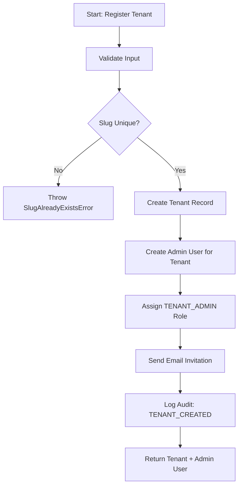
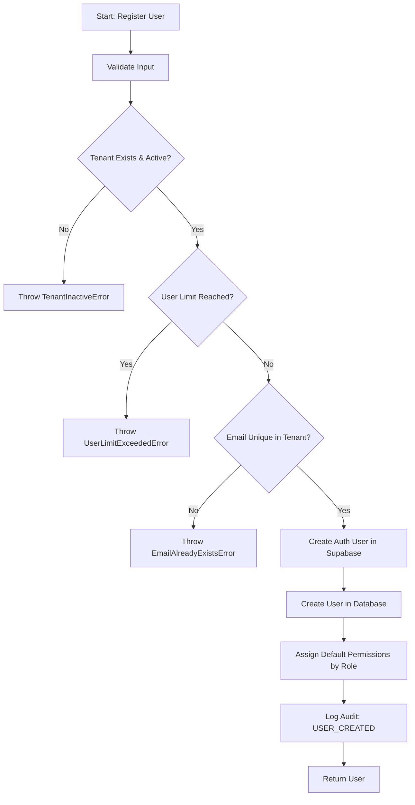
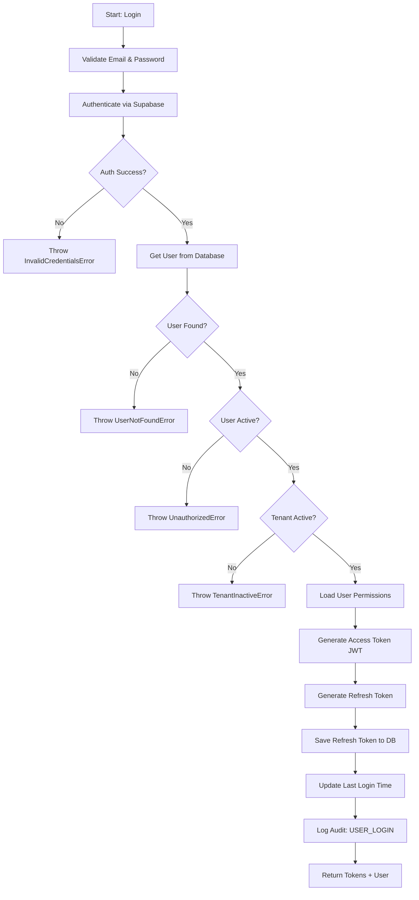
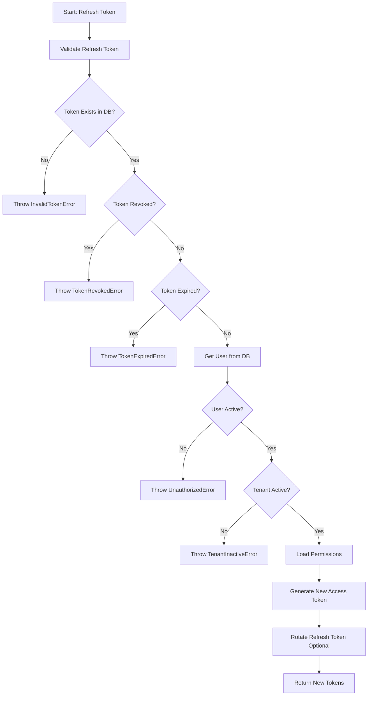

# 🎯 Use Cases - Gizi Platform Auth System

> **Version**: 1.0.0  
> **Last Updated**: 2025-12-28  
> **Layer**: Application Layer

---

## 📋 Table of Contents

1. [Use Case Overview](#use-case-overview)
2. [Tenant Management Use Cases](#tenant-management-use-cases)
3. [User Management Use Cases](#user-management-use-cases)
4. [Authentication Use Cases](#authentication-use-cases)
5. [Authorization Use Cases](#authorization-use-cases)
6. [Use Case Implementation Pattern](#use-case-implementation-pattern)

---

## 🎯 Use Case Overview

### What is Use Case?

Use Case adalah **business flow** yang mengorkestra domain entities, repositories, dan services untuk mencapai satu tujuan bisnis.

### Characteristics

✅ **Single Responsibility** - Satu use case = satu business flow  
✅ **Orchestration** - Coordinates domain objects & repositories  
✅ **Transaction Boundary** - Satu use case = satu database transaction  
✅ **Input/Output** - Terima DTO, return DTO (bukan entity langsung)  
✅ **Error Handling** - Throw domain errors yang meaningful

### Use Case Structure

```
src/modules/auth/application/
├── use-cases/
│   ├── tenant/
│   │   ├── register-tenant.use-case.ts
│   │   ├── activate-tenant.use-case.ts
│   │   └── deactivate-tenant.use-case.ts
│   ├── user/
│   │   ├── register-user.use-case.ts
│   │   ├── assign-role.use-case.ts
│   │   └── assign-permission.use-case.ts
│   └── auth/
│       ├── login.use-case.ts
│       ├── refresh-token.use-case.ts
│       ├── verify-token.use-case.ts
│       ├── logout.use-case.ts
│       ├── request-password-reset.use-case.ts
│       └── reset-password.use-case.ts
└── dto/ (shared DTOs)
    ├── auth.dto.ts
    ├── user.dto.ts
    └── tenant.dto.ts
```

---

## 🏢 Tenant Management Use Cases

### 1. Register Tenant Use Case

**Actor**: Super Admin (Platform Admin)  
**Purpose**: Create new tenant (organisasi seperti Dinas Kesehatan)

**Flow**:



**Input DTO**:

```typescript
export interface RegisterTenantInput {
    name: string; // "Dinas Kesehatan Kota Bandung"
    slug: string; // "dinkes-bandung" (URL-friendly)
    subscriptionPlan: "BASIC" | "PROFESSIONAL" | "ENTERPRISE";
    maxUsers: number;
    adminEmail: string;
    adminFullName: string;
    adminPassword: string; // Akan di-hash via Supabase
    contactEmail?: string;
    contactPhone?: string;
    config?: {
        features?: string[];
        branding?: {
            logo?: string;
            primaryColor?: string;
            appName?: string;
        };
    };
}
```

**Output**:

```typescript
export interface RegisterTenantOutput {
    tenant: {
        id: string;
        name: string;
        slug: string;
        subscriptionPlan: string;
        subscriptionStatus: string;
    };
    adminUser: {
        id: string;
        email: string;
        fullName: string;
        role: string;
    };
}
```

**Implementation**:

**File**: `src/modules/auth/application/use-cases/tenant/register-tenant.use-case.ts`

```typescript
import { ITenantRepository } from "@/modules/auth/domain/repositories/ITenantRepository";
import { IUserRepository } from "@/modules/auth/domain/repositories/IUserRepository";
import { IAuthProvider } from "@/modules/auth/domain/services/IAuthProvider";
import { IAuditLogRepository } from "@/modules/auth/domain/repositories/IAuditLogRepository";
import { Email } from "@/modules/auth/domain/value-objects/Email.vo";
import { Password } from "@/modules/auth/domain/value-objects/Password.vo";
import { TenantId } from "@/modules/auth/domain/value-objects/TenantId.vo";
import { Role, RoleEnum } from "@/modules/auth/domain/value-objects/Role.vo";
import {
    RegisterTenantInput,
    RegisterTenantOutput,
} from "../../dto/tenant.dto";

export class RegisterTenantUseCase {
    constructor(
        private tenantRepo: ITenantRepository,
        private userRepo: IUserRepository,
        private authProvider: IAuthProvider,
        private auditLogRepo: IAuditLogRepository
    ) {}

    async execute(input: RegisterTenantInput): Promise<RegisterTenantOutput> {
        // 1. Validate input
        const email = new Email(input.adminEmail);
        const password = new Password(input.adminPassword);

        // 2. Check slug unique
        const existingTenant = await this.tenantRepo.findBySlug(input.slug);
        if (existingTenant) {
            throw new SlugAlreadyExistsError(input.slug);
        }

        // 3. Create tenant
        const tenant = await this.tenantRepo.create({
            name: input.name,
            slug: input.slug,
            subscriptionPlan: input.subscriptionPlan,
            maxUsers: input.maxUsers,
            contactEmail: input.contactEmail,
            contactPhone: input.contactPhone,
            config: input.config,
        });

        // 4. Create admin user di Supabase Auth
        const authResult = await this.authProvider.signUp(
            email.getValue(),
            password.getValue()
        );

        // 5. Create admin user di database
        const adminUser = await this.userRepo.create({
            tenantId: tenant.id,
            supabaseAuthId: authResult.authUserId,
            email: email,
            fullName: input.adminFullName,
            role: RoleEnum.TENANT_ADMIN,
            metadata: {
                createdByPlatformAdmin: true,
            },
        });

        // 6. Log audit
        await this.auditLogRepo.log({
            tenantId: tenant.id.getValue(),
            userId: null, // Platform action
            action: "TENANT_CREATED",
            resource: "tenants",
            resourceId: tenant.id.getValue(),
            newValue: tenant.toObject(),
        });

        // 7. Return result
        return {
            tenant: {
                id: tenant.id.getValue(),
                name: tenant.name,
                slug: tenant.slug,
                subscriptionPlan: tenant.toObject().subscriptionPlan,
                subscriptionStatus: tenant.subscriptionStatus,
            },
            adminUser: {
                id: adminUser.id.getValue(),
                email: adminUser.email.getValue(),
                fullName: adminUser.toObject().fullName,
                role: adminUser.role.getValue(),
            },
        };
    }
}
```

**Business Rules**:

- ✅ Hanya Super Admin bisa create tenant
- ✅ Slug harus unique (untuk subdomain)
- ✅ Auto-create admin user dengan role TENANT_ADMIN
- ✅ Send email invitation ke admin (future: via email service)

---

### 2. Activate/Deactivate Tenant Use Case

**Actor**: Super Admin  
**Purpose**: Activate atau deactivate tenant (subscription management)

**Simplified Implementation** (similar pattern):

```typescript
export class ActivateTenantUseCase {
    async execute(tenantId: string, activatedBy: string): Promise<void> {
        const tenant = await this.tenantRepo.findById(new TenantId(tenantId));
        if (!tenant) throw new TenantNotFoundError(tenantId);

        tenant.activate();
        await this.tenantRepo.update(tenant.id, {
            subscriptionStatus: "ACTIVE",
        });

        await this.auditLogRepo.log({
            action: "TENANT_ACTIVATED",
            userId: activatedBy,
            // ...
        });
    }
}
```

---

## 👤 User Management Use Cases

### 1. Register User Use Case

**Actor**: Tenant Admin (create user di tenant mereka) atau Super Admin  
**Purpose**: Create user baru dengan role & scope tertentu

**Flow**:



**Input DTO**:

```typescript
export interface RegisterUserInput {
    tenantId: string;
    email: string;
    password: string;
    fullName: string;
    phoneNumber?: string;
    role: string; // e.g., 'KADER', 'UNIT_ADMIN'
    scopeUnitId?: string; // Wajib untuk role KADER, UNIT_ADMIN, UNIT_HEAD
    scopeRegionId?: string; // Wajib untuk role VILLAGE_HEAD, DISTRICT_HEAD
    metadata?: Record<string, any>;
}
```

**File**: `src/modules/auth/application/use-cases/user/register-user.use-case.ts`

```typescript
export class RegisterUserUseCase {
    constructor(
        private userRepo: IUserRepository,
        private tenantRepo: ITenantRepository,
        private permissionRepo: IPermissionRepository,
        private authProvider: IAuthProvider,
        private auditLogRepo: IAuditLogRepository
    ) {}

    async execute(input: RegisterUserInput): Promise<UserOutput> {
        // 1. Validate
        const email = new Email(input.email);
        const password = new Password(input.password);
        const role = new Role(input.role);
        const tenantId = new TenantId(input.tenantId);

        // 2. Check tenant exists & active
        const tenant = await this.tenantRepo.findById(tenantId);
        if (!tenant) throw new TenantNotFoundError(input.tenantId);
        if (!tenant.isActive()) throw new TenantInactiveError(input.tenantId);

        // 3. Check user limit
        const userCount = await this.userRepo.countByTenant(tenantId);
        if (userCount >= tenant.maxUsers) {
            throw new UserLimitExceededError(input.tenantId, tenant.maxUsers);
        }

        // 4. Check email unique (per tenant)
        const existingUser = await this.userRepo.findByEmail(email, tenantId);
        if (existingUser) {
            throw new EmailAlreadyExistsError(email.getValue());
        }

        // 5. Validate scope based on role
        this.validateScope(role, input.scopeUnitId, input.scopeRegionId);

        // 6. Create auth user
        const authResult = await this.authProvider.signUp(
            email.getValue(),
            password.getValue()
        );

        // 7. Create user in database
        const user = await this.userRepo.create({
            tenantId: tenantId,
            supabaseAuthId: authResult.authUserId,
            email: email,
            fullName: input.fullName,
            role: role.getValue(),
            scopeUnitId: input.scopeUnitId,
            scopeRegionId: input.scopeRegionId,
            metadata: input.metadata,
        });

        // 8. Assign default permissions by role
        await this.assignDefaultPermissions(user.id, role);

        // 9. Log audit
        await this.auditLogRepo.log({
            tenantId: tenantId.getValue(),
            action: "USER_CREATED",
            resource: "users",
            resourceId: user.id.getValue(),
            newValue: user.toObject(),
        });

        return this.mapToOutput(user);
    }

    private validateScope(
        role: Role,
        unitId?: string,
        regionId?: string
    ): void {
        if (role.isUnitLevel() && !unitId) {
            throw new InvalidScopeError("Unit scope required for this role");
        }
        if (role.isTerritoryLevel() && !regionId) {
            throw new InvalidScopeError("Region scope required for this role");
        }
    }

    private async assignDefaultPermissions(
        userId: UserId,
        role: Role
    ): Promise<void> {
        // Get default permissions for role from role_permissions table
        const permissions = await this.permissionRepo.findByRole(
            role.getValue()
        );
        if (permissions.length > 0) {
            await this.permissionRepo.assignToUser(
                userId.getValue(),
                permissions
            );
        }
    }

    private mapToOutput(user: User): UserOutput {
        return {
            id: user.id.getValue(),
            email: user.email.getValue(),
            fullName: user.toObject().fullName,
            role: user.role.getValue(),
            isActive: user.isActive,
            createdAt: user.toObject().createdAt,
        };
    }
}
```

**Business Rules**:

- ✅ Tenant harus active
- ✅ Belum exceed user limit
- ✅ Email unique per tenant
- ✅ Role UNIT_LEVEL wajib ada `scopeUnitId`
- ✅ Role TERRITORY_LEVEL wajib ada `scopeRegionId`
- ✅ Auto-assign default permissions by role

---

### 2. Assign Role Use Case

**Actor**: Tenant Admin atau Super Admin  
**Purpose**: Change role user

**File**: `src/modules/auth/application/use-cases/user/assign-role.use-case.ts`

```typescript
export interface AssignRoleInput {
    userId: string;
    newRole: string;
    assignedBy: string; // User ID yang melakukan assign
}

export class AssignRoleUseCase {
    async execute(input: AssignRoleInput): Promise<void> {
        const userId = new UserId(input.userId);
        const newRole = new Role(input.newRole);
        const assignerId = new UserId(input.assignedBy);

        // 1. Get target user
        const user = await this.userRepo.findById(userId);
        if (!user) throw new UserNotFoundError(input.userId);

        // 2. Get assigner user (who is doing the assignment)
        const assigner = await this.userRepo.findById(assignerId);
        if (!assigner) throw new UnauthorizedError();

        // 3. Check permission (can assigner assign this role?)
        if (!assigner.canAssignRole(newRole)) {
            throw new PermissionDeniedError(
                `Cannot assign role ${newRole.getValue()}`
            );
        }

        // 4. Store old role for audit
        const oldRole = user.role.getValue();

        // 5. Change role
        user.changeRole(newRole);
        await this.userRepo.update(userId, { role: newRole.getValue() });

        // 6. Update permissions (remove old role permissions, add new role permissions)
        await this.permissionRepo.revokeAllFromUser(userId.getValue());
        await this.assignDefaultPermissions(userId, newRole);

        // 7. Log audit
        await this.auditLogRepo.log({
            tenantId: user.tenantId?.getValue(),
            userId: assignerId.getValue(),
            action: "ROLE_ASSIGNED",
            resource: "users",
            resourceId: userId.getValue(),
            oldValue: { role: oldRole },
            newValue: { role: newRole.getValue() },
        });
    }
}
```

---

### 3. Assign Permission Use Case

**Actor**: Tenant Admin atau Super Admin  
**Purpose**: Override permission untuk user tertentu (grant atau revoke)

**Flow**: Similar to Assign Role, tapi update `user_permissions` table

---

## 🔐 Authentication Use Cases

### 1. Login Use Case

**Actor**: Any user  
**Purpose**: Authenticate user & generate JWT tokens

**Flow**:



**Input DTO**:

```typescript
export interface LoginInput {
    email: string;
    password: string;
    ipAddress?: string;
    userAgent?: string;
}
```

**Output DTO**:

```typescript
export interface LoginOutput {
    accessToken: string; // JWT (15 min expiry)
    refreshToken: string; // Random token (30 days expiry)
    user: {
        id: string;
        email: string;
        fullName: string;
        role: string;
        tenantId: string | null;
        scopeUnitId?: string | null;
        scopeRegionId?: string | null;
        permissions: string[]; // e.g., ['users:read', 'children:write']
    };
}
```

**File**: `src/modules/auth/application/use-cases/auth/login.use-case.ts`

```typescript
export class LoginUseCase {
    constructor(
        private authProvider: IAuthProvider,
        private userRepo: IUserRepository,
        private tenantRepo: ITenantRepository,
        private permissionRepo: IPermissionRepository,
        private refreshTokenRepo: IRefreshTokenRepository,
        private auditLogRepo: IAuditLogRepository,
        private tokenService: TokenService
    ) {}

    async execute(input: LoginInput): Promise<LoginOutput> {
        // 1. Validate input
        const email = new Email(input.email);
        const password = new Password(input.password);

        // 2. Authenticate via Supabase
        const authResult = await this.authProvider.signIn(
            email.getValue(),
            password.getValue()
        );

        // 3. Get user from database
        const user = await this.userRepo.findBySupabaseAuthId(
            authResult.authUserId
        );
        if (!user) {
            throw new UserNotFoundError(email.getValue());
        }

        // 4. Check user active
        if (!user.isActive) {
            throw new UnauthorizedError("Account is deactivated");
        }

        // 5. Check tenant active (if user has tenant)
        if (user.tenantId) {
            const tenant = await this.tenantRepo.findById(user.tenantId);
            if (!tenant || !tenant.isActive()) {
                throw new TenantInactiveError(user.tenantId.getValue());
            }
        }

        // 6. Load user permissions
        const permissions = await this.permissionRepo.findEffectiveByUserId(
            user.id.getValue()
        );

        // 7. Generate access token (JWT)
        const accessToken = this.tokenService.generateAccessToken({
            userId: user.id.getValue(),
            email: user.email.getValue(),
            tenantId: user.tenantId?.getValue() ?? null,
            role: user.role.getValue(),
            permissions: permissions.map((p) => p.getValue()),
            scopeUnitId: user.scopeUnitId,
            scopeRegionId: user.scopeRegionId,
        });

        // 8. Generate refresh token
        const refreshToken = this.tokenService.generateRefreshToken();
        const expiresAt = new Date(Date.now() + 30 * 24 * 60 * 60 * 1000); // 30 days

        // 9. Save refresh token
        await this.refreshTokenRepo.create({
            userId: user.id.getValue(),
            token: refreshToken,
            expiresAt: expiresAt,
            ipAddress: input.ipAddress,
            userAgent: input.userAgent,
        });

        // 10. Update last login
        await this.userRepo.update(user.id, {
            lastLoginAt: new Date(),
        });

        // 11. Log audit
        await this.auditLogRepo.log({
            tenantId: user.tenantId?.getValue(),
            userId: user.id.getValue(),
            action: "USER_LOGIN",
            ipAddress: input.ipAddress,
            userAgent: input.userAgent,
        });

        // 12. Return
        return {
            accessToken,
            refreshToken,
            user: {
                id: user.id.getValue(),
                email: user.email.getValue(),
                fullName: user.toObject().fullName,
                role: user.role.getValue(),
                tenantId: user.tenantId?.getValue() ?? null,
                scopeUnitId: user.scopeUnitId,
                scopeRegionId: user.scopeRegionId,
                permissions: permissions.map((p) => p.getValue()),
            },
        };
    }
}
```

**JWT Payload Structure**:

```json
{
    "userId": "uuid",
    "email": "user@example.com",
    "tenantId": "tenant-uuid",
    "role": "KADER",
    "permissions": ["children:read", "children:write", "measurements:write"],
    "scopeUnitId": "unit-uuid",
    "scopeRegionId": null,
    "iat": 1672444800,
    "exp": 1672445700
}
```

---

### 2. Refresh Token Use Case

**Actor**: Authenticated user (with valid refresh token)  
**Purpose**: Get new access token tanpa login ulang

**Flow**:



**File**: `src/modules/auth/application/use-cases/auth/refresh-token.use-case.ts`

```typescript
export interface RefreshTokenInput {
    refreshToken: string;
}

export interface RefreshTokenOutput {
    accessToken: string;
    refreshToken: string; // Same or rotated
}

export class RefreshTokenUseCase {
    async execute(input: RefreshTokenInput): Promise<RefreshTokenOutput> {
        // 1. Find refresh token in DB
        const session = await this.refreshTokenRepo.findByToken(
            input.refreshToken
        );
        if (!session) {
            throw new InvalidTokenError();
        }

        // 2. Check not revoked
        if (session.revoked) {
            throw new TokenRevokedError();
        }

        // 3. Check not expired
        if (session.isExpired()) {
            throw new TokenExpiredError();
        }

        // 4. Get user
        const user = await this.userRepo.findById(new UserId(session.userId));
        if (!user || !user.isActive) {
            throw new UnauthorizedError();
        }

        // 5. Check tenant active
        if (user.tenantId) {
            const tenant = await this.tenantRepo.findById(user.tenantId);
            if (!tenant || !tenant.isActive()) {
                throw new TenantInactiveError(user.tenantId.getValue());
            }
        }

        // 6. Load permissions (mungkin berubah sejak login terakhir)
        const permissions = await this.permissionRepo.findEffectiveByUserId(
            user.id.getValue()
        );

        // 7. Generate new access token
        const accessToken = this.tokenService.generateAccessToken({
            userId: user.id.getValue(),
            email: user.email.getValue(),
            tenantId: user.tenantId?.getValue() ?? null,
            role: user.role.getValue(),
            permissions: permissions.map((p) => p.getValue()),
            scopeUnitId: user.scopeUnitId,
            scopeRegionId: user.scopeRegionId,
        });

        // 8. Optional: Rotate refresh token (for extra security)
        // const newRefreshToken = this.tokenService.generateRefreshToken();
        // await this.refreshTokenRepo.revoke(input.refreshToken);
        // await this.refreshTokenRepo.create({ ... });

        return {
            accessToken,
            refreshToken: input.refreshToken, // Or newRefreshToken if rotated
        };
    }
}
```

---

### 3. Verify Token Use Case

**Actor**: Middleware  
**Purpose**: Verify JWT access token & return user metadata

**File**: `src/modules/auth/application/use-cases/auth/verify-token.use-case.ts`

```typescript
export interface VerifyTokenInput {
    token: string;
}

export interface VerifyTokenOutput {
    userId: string;
    email: string;
    tenantId: string | null;
    role: string;
    permissions: string[];
    scopeUnitId?: string | null;
    scopeRegionId?: string | null;
}

export class VerifyTokenUseCase {
    async execute(input: VerifyTokenInput): Promise<VerifyTokenOutput> {
        try {
            // 1. Verify & decode JWT
            const payload = this.tokenService.verifyAccessToken(input.token);

            // 2. Return user metadata (dari JWT payload)
            return {
                userId: payload.userId,
                email: payload.email,
                tenantId: payload.tenantId,
                role: payload.role,
                permissions: payload.permissions,
                scopeUnitId: payload.scopeUnitId,
                scopeRegionId: payload.scopeRegionId,
            };
        } catch (error) {
            throw new TokenExpiredError();
        }
    }
}
```

**Note**: Ini **tidak** query database (fast). JWT payload sudah berisi semua info yang dibutuhkan. Trade-off: jika permission berubah, user harus login ulang atau refresh token.

---

### 4. Logout Use Case

**Actor**: Authenticated user  
**Purpose**: Revoke refresh token

**File**: `src/modules/auth/application/use-cases/auth/logout.use-case.ts`

```typescript
export interface LogoutInput {
    refreshToken: string;
    userId: string; // From JWT
}

export class LogoutUseCase {
    async execute(input: LogoutInput): Promise<void> {
        // 1. Revoke refresh token
        await this.refreshTokenRepo.revoke(input.refreshToken);

        // 2. Log audit
        await this.auditLogRepo.log({
            userId: input.userId,
            action: "USER_LOGOUT",
        });
    }
}
```

**Note**: Access token tetap valid sampai expired (15 menit). Untuk immediate revocation, perlu blacklist (complexity tambahan).

---

### 5. Password Reset Use Cases

**5a. Request Password Reset**

```typescript
export class RequestPasswordResetUseCase {
    async execute(email: string): Promise<void> {
        // Trigger Supabase password reset email
        await this.authProvider.sendPasswordResetEmail(email);

        // Log audit (without exposing if email exists or not untuk security)
        await this.auditLogRepo.log({
            action: "PASSWORD_RESET_REQUESTED",
            metadata: { email },
        });
    }
}
```

**5b. Reset Password**

```typescript
export class ResetPasswordUseCase {
    async execute(resetToken: string, newPassword: string): Promise<void> {
        const password = new Password(newPassword); // Validate strength

        await this.authProvider.resetPassword(resetToken, password.getValue());

        // Revoke all active sessions (force re-login)
        // const user = await this.userRepo.findBySupabaseAuthId(...);
        // await this.refreshTokenRepo.revokeAllByUserId(user.id.getValue());
    }
}
```

---

## 🔒 Authorization Use Cases

### 1. Check Permission Use Case

**Actor**: Middleware / Authorization layer  
**Purpose**: Check apakah user punya permission untuk akses resource

**File**: `src/modules/auth/application/use-cases/auth/check-permission.use-case.ts`

```typescript
export interface CheckPermissionInput {
    userId: string;
    permission: string; // e.g., 'children:write'
    resourceId?: string; // Optional: for scope validation
    resourceType?: "unit" | "region"; // For scope check
}

export class CheckPermissionUseCase {
    async execute(input: CheckPermissionInput): Promise<boolean> {
        // 1. Get user
        const user = await this.userRepo.findById(new UserId(input.userId));
        if (!user) return false;

        // 2. Check permission
        const permission = new Permission(input.permission);
        if (!user.hasPermission(permission)) {
            return false;
        }

        // 3. Check scope (if resource specified)
        if (input.resourceId && input.resourceType) {
            if (input.resourceType === "unit") {
                return user.isInUnitScope(input.resourceId);
            }
            if (input.resourceType === "region") {
                return user.isInRegionScope(input.resourceId);
            }
        }

        return true;
    }
}
```

**Usage in Middleware**:

```typescript
// Before mengizinkan user create measurement di unit tertentu
const hasPermission = await checkPermissionUseCase.execute({
    userId: currentUser.id,
    permission: "measurements:write",
    resourceId: requestBody.unitId,
    resourceType: "unit",
});

if (!hasPermission) {
    throw new PermissionDeniedError("measurements:write");
}
```

---

## 🧩 Use Case Implementation Pattern

### Base Use Case Class (Optional)

```typescript
export abstract class BaseUseCase<TInput, TOutput> {
    abstract execute(input: TInput): Promise<TOutput>;
}
```

### Dependency Injection

Gunakan **constructor injection** untuk repositories & services:

```typescript
export class SomeUseCase {
    constructor(
        private userRepo: IUserRepository,
        private authProvider: IAuthProvider
    ) {}
}
```

**Setup DI Container** (future):

```typescript
// src/core/di/container.ts
import { UserRepository } from "@/modules/auth/infrastructure/repositories/UserRepository";
import { SupabaseAuthProvider } from "@/modules/auth/infrastructure/supabase/SupabaseAuthProvider";

export const container = {
    userRepo: new UserRepository(db),
    authProvider: new SupabaseAuthProvider(supabaseClient),
};

// Usage
const loginUseCase = new LoginUseCase(
    container.authProvider,
    container.userRepo
    // ...
);
```

---

## ✅ Checklist

### Tenant Management

- [ ] Implement `RegisterTenantUseCase`
- [ ] Implement `ActivateTenantUseCase`
- [ ] Implement `DeactivateTenantUseCase`

### User Management

- [ ] Implement `RegisterUserUseCase`
- [ ] Implement `AssignRoleUseCase`
- [ ] Implement `AssignPermissionUseCase`

### Authentication

- [ ] Implement `LoginUseCase`
- [ ] Implement `RefreshTokenUseCase`
- [ ] Implement `VerifyTokenUseCase`
- [ ] Implement `LogoutUseCase`
- [ ] Implement `RequestPasswordResetUseCase`
- [ ] Implement `ResetPasswordUseCase`

### Authorization

- [ ] Implement `CheckPermissionUseCase`
- [ ] Implement `GetUserScopeFilterUseCase`

### Testing

- [ ] Write integration tests untuk happy path
- [ ] Write tests untuk error cases
- [ ] Test multi-tenant isolation
- [ ] Test scope-based access

---

**Next**: [04-INFRASTRUCTURE.md](./04-INFRASTRUCTURE.md)
