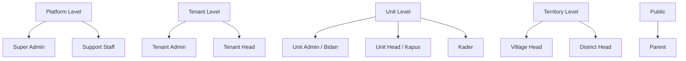
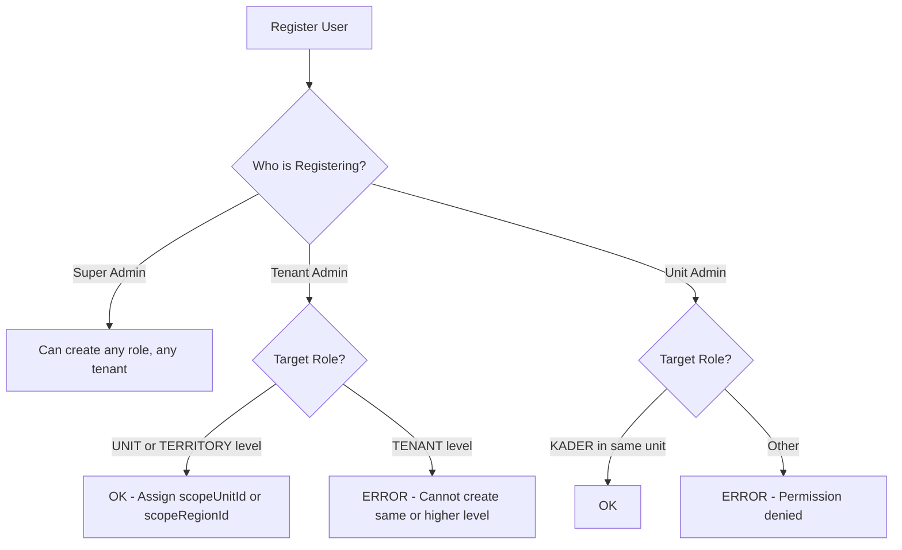
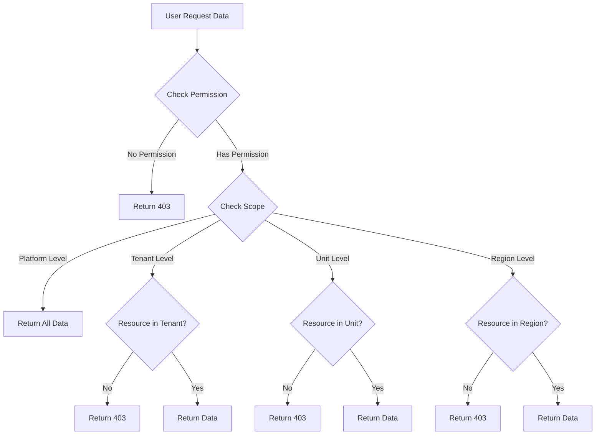

# 🔐 Role & Permission System - Deep Dive

> **Version**: 1.0.0  
> **Last Updated**: 2025-12-28  
> **Purpose**: Comprehensive guide untuk role-based & permission-based access control

---

## 📋 Table of Contents

1. [System Overview](#system-overview)
2. [Role Matrix](#role-matrix)
3. [Permission Design](#permission-design)
4. [Scope-Based Access](#scope-based-access)
5. [Decision Tree](#decision-tree)
6. [Implementation Examples](#implementation-examples)

---

## 🎯 System Overview

### Authorization Strategy

Gizi Platform menggunakan **hybrid RBAC + PBAC**:

1. **Role-Based Access Control (RBAC)** - User punya role, role punya default permissions
2. **Permission-Based Access Control (PBAC)** - Granular control per action
3. **Scope-Based Filtering** - Data filtering by tenant/unit/region

### Why Hybrid?

✅ **Flexibility** - Permission bisa di-override per user tanpa create role baru  
✅ **Scalability** - Mudah tambah permission baru tanpa ubah code  
✅ **Audit Trail** - Track permission changes dengan jelas

---

## 👥 Role Matrix

### Role Hierarchy & Categories



### Detailed Role Specifications

#### Platform Level (Internal Team)

##### 1. SUPER_ADMIN

**Level**: 1 (Highest)  
**Category**: PLATFORM  
**Description**: Pemilik aplikasi / developer team

**Capabilities**:

- ✅ Full access ke semua tenant
- ✅ Create/delete tenant
- ✅ Manage subscription & billing
- ✅ Access database directly (emergency)
- ✅ Override any restriction

**Scope**: Global (tidak ada tenant_id)

**Default Permissions**: ALL

**Use Case**:

- Setup tenant baru untuk klien
- Troubleshoot production issues
- Generate global analytics

---

##### 2. SUPPORT_STAFF

**Level**: 2  
**Category**: PLATFORM  
**Description**: Customer support team

**Capabilities**:

- ✅ View all tenant (read-only)
- ✅ Impersonate user (untuk debugging)
- ✅ Reset password atas permintaan user
- ❌ Tidak bisa ubah subscription

**Scope**: Global (read-only)

**Default Permissions**:

- `tenants:read`
- `users:read`
- `support:impersonate`

**Use Case**:

- Help user yang lupa password
- Debug issue di tenant tertentu
- Generate report untuk klien

---

#### Tenant Level (Klien - Dinas/Klinik)

##### 3. TENANT_ADMIN

**Level**: 3  
**Category**: TENANT  
**Description**: IT Staff atau Program Manager Gizi di Dinas/Klinik

**Capabilities**:

- ✅ Manage users di tenant mereka
- ✅ Assign role (kecuali TENANT_ADMIN ke user lain)
- ✅ Setup master data (Puskesmas, Desa)
- ✅ Export semua data tenant
- ✅ View analytics tenant-wide
- ❌ Tidak bisa create tenant baru

**Scope**: Tenant (all units & regions dalam tenant)

**Default Permissions**:

- `users:read`, `users:write`, `users:delete`
- `roles:assign` (limited to Unit & Territory level)
- `children:read`, `children:write`, `children:delete`
- `measurements:read`, `measurements:write`, `measurements:approve`
- `reports:read`, `reports:export`
- `units:read`, `units:write` (Puskesmas, Posyandu)
- `regions:read`, `regions:write` (Kecamatan, Desa)

**Use Case**:

- Setup struktur organisasi (Puskesmas & Posyandu)
- Create akun untuk Bidan & Kader
- Export laporan bulanan untuk Kepala Dinas
- Monitor performa seluruh Puskesmas

---

##### 4. TENANT_HEAD

**Level**: 4  
**Category**: TENANT  
**Description**: Kepala Dinas Kesehatan (Pejabat)

**Capabilities**:

- ✅ View dashboard executive
- ✅ View analytics & reports
- ✅ Export reports
- ❌ Tidak bisa create/edit user
- ❌ Tidak bisa input data (read-only)

**Scope**: Tenant (view only)

**Default Permissions**:

- `children:read`
- `measurements:read`
- `reports:read`, `reports:export`
- `analytics:view`

**Use Case**:

- Lihat peta sebaran stunting
- Monitor trend bulanan
- Download report untuk rapat

---

#### Unit Level (Fasilitas Kesehatan)

##### 5. UNIT_ADMIN

**Level**: 5  
**Category**: UNIT  
**Description**: Bidan Koordinator atau Ahli Gizi (TPG) di Puskesmas

**Capabilities**:

- ✅ Validate data dari Kader
- ✅ Approve/reject status stunting
- ✅ Create akun Kader di unit nya
- ✅ Input data jika perlu (backup untuk Kader)
- ✅ View report per unit
- ❌ Tidak bisa lihat data unit lain

**Scope**: Unit (scoped to `scope_unit_id`)

**Default Permissions**:

- `users:read`, `users:write` (limited to Kader in their unit)
- `children:read`, `children:write`
- `measurements:read`, `measurements:write`, `measurements:approve`
- `reports:read`

**Use Case**:

- Verify hasil ukur dari Kader (approve/reject)
- Create akun untuk Kader baru
- Export laporan Puskesmas untuk dilaporkan ke Dinas

---

##### 6. UNIT_HEAD

**Level**: 6  
**Category**: UNIT  
**Description**: Kepala Puskesmas (Kapus)

**Capabilities**:

- ✅ View dashboard Puskesmas
- ✅ Approve rujukan (jika ada fitur rujukan)
- ❌ Tidak bisa input data (delegasi ke Bidan)

**Scope**: Unit (view only)

**Default Permissions**:

- `children:read`
- `measurements:read`
- `reports:read`
- `referrals:approve` (future feature)

**Use Case**:

- Monitor performa Posyandu di bawah Puskesmas
- Approve rujukan ke RS

---

##### 7. KADER

**Level**: 7  
**Category**: UNIT  
**Description**: Relawan warga di Posyandu (ujung tombak)

**Capabilities**:

- ✅ Input BB/TB anak di Posyandu
- ✅ Register anak baru
- ✅ View data anak di Posyandu nya
- ❌ Tidak bisa approve (data pending validation)
- ❌ Tidak bisa delete data

**Scope**: Unit (scoped to `scope_unit_id` = Posyandu tertentu)

**Default Permissions**:

- `children:read`, `children:write` (limited to their unit)
- `measurements:write`

**Use Case**:

- Input hasil timbang di hari Posyandu
- Lihat riwayat anak yang datang

**UI Requirements**: **SUPER SIMPEL** - mobile-first, minimal clicks

---

#### Territory Level (Pemerintah Wilayah)

##### 8. VILLAGE_HEAD

**Level**: 8  
**Category**: TERRITORY  
**Description**: Kepala Desa / Lurah

**Capabilities**:

- ✅ View data anak di desa mereka (read-only)
- ✅ View list nama anak stunting (untuk bantuan PMT)
- ✅ Export Excel untuk administrasi
- ❌ Tidak bisa input data (bukan tenaga medis)

**Scope**: Region (scoped to `scope_region_id` = Desa tertentu)

**Default Permissions**:

- `children:read` (filtered by region)
- `reports:read`, `reports:export`

**Use Case**:

- Download daftar anak stunting untuk penyaluran PMT dari Dana Desa
- Monitor jumlah stunting vs target desa

---

##### 9. DISTRICT_HEAD

**Level**: 7  
**Category**: TERRITORY  
**Description**: Camat

**Capabilities**:

- ✅ View agregasi data desa-desa di kecamatan
- ✅ View heatmap Kecamatan
- ❌ Tidak bisa input data

**Scope**: Region (scoped to `scope_region_id` = Kecamatan)

**Default Permissions**:

- `children:read` (agregasi per desa)
- `reports:read`, `reports:export`
- `analytics:view` (kecamatan level)

**Use Case**:

- Monitor performa desa-desa
- Laporan ke Bupati

---

#### Public Level

##### 10. PARENT

**Level**: 9  
**Category**: PUBLIC  
**Description**: Orang tua balita

**Capabilities**:

- ✅ View data anak sendiri (Digital KMS)
- ✅ View grafik pertumbuhan
- ✅ View jadwal imunisasi
- ❌ Tidak bisa lihat data anak lain

**Scope**: Self (hanya data anak sendiri)

**Default Permissions**:

- `children:read` (own children only)
- `measurements:read` (own children only)
- `schedule:read`

**Use Case**:

- Cek grafik pertumbuhan anak
- Lihat jadwal Posyandu
- Baca artikel edukasi gizi

**Authentication**: Login via No HP / WhatsApp (simplified)

---

## 🎫 Permission Design

### Permission Naming Convention

Format: `<resource>:<action>`

**Resources**:

- `tenants` - Organisasi (Dinas/Klinik)
- `users` - User management
- `roles` - Role assignment
- `permissions` - Permission grant/revoke
- `children` - Data anak (master data)
- `measurements` - Data timbang (BB/TB)
- `reports` - Laporan & analytics
- `units` - Puskesmas/Posyandu/Klinik
- `regions` - Kecamatan/Desa
- `referrals` - Rujukan (future)

**Actions**:

- `read` - View data
- `write` - Create & update
- `delete` - Soft delete
- `approve` - Approval workflow
- `export` - Export to Excel/PDF
- `assign` - Assign role/permission

### Permission Matrix

| Resource         | read                                  | write                                 | delete                    | approve    | export                                  | assign                    |
| ---------------- | ------------------------------------- | ------------------------------------- | ------------------------- | ---------- | --------------------------------------- | ------------------------- |
| **tenants**      | SUPER_ADMIN, SUPPORT_STAFF            | SUPER_ADMIN                           | SUPER_ADMIN               | -          | SUPER_ADMIN                             | -                         |
| **users**        | SUPER_ADMIN, TENANT_ADMIN, UNIT_ADMIN | SUPER_ADMIN, TENANT_ADMIN, UNIT_ADMIN | SUPER_ADMIN, TENANT_ADMIN | -          | TENANT_ADMIN                            | -                         |
| **roles**        | All                                   | -                                     | -                         | -          | -                                       | SUPER_ADMIN, TENANT_ADMIN |
| **children**     | All (scoped)                          | TENANT_ADMIN, UNIT_ADMIN, KADER       | TENANT_ADMIN              | -          | TENANT_ADMIN, UNIT_ADMIN                | -                         |
| **measurements** | All (scoped)                          | TENANT_ADMIN, UNIT_ADMIN, KADER       | TENANT_ADMIN              | UNIT_ADMIN | TENANT_ADMIN                            | -                         |
| **reports**      | All (scoped)                          | -                                     | -                         | -          | TENANT_ADMIN, TENANT_HEAD, VILLAGE_HEAD | -                         |

### Dynamic Permissions (Extensible)

Permission bisa ditambah tanpa ubah code:

```typescript
// Seed new permission
await db.insert(permissions).values({
    name: "analytics:view",
    resource: "analytics",
    action: "view",
    description: "View analytics dashboard",
});

// Assign to role
await db.insert(rolePermissions).values({
    roleId: tenantHeadRoleId,
    permissionId: analyticsViewPermissionId,
});
```

---

## 🎯 Scope-Based Access

### Scope Types

1. **Global Scope** (Super Admin, Support Staff)
    - No tenant_id, unit_id, region_id
    - Can access all data

2. **Tenant Scope** (Tenant Admin, Tenant Head)
    - Filter by `tenant_id`
    - Can access all units & regions dalam tenant

3. **Unit Scope** (Unit Admin, Unit Head, Kader)
    - Filter by `tenant_id` AND `scope_unit_id`
    - Can only access data di unit mereka

4. **Region Scope** (Village Head, District Head)
    - Filter by `tenant_id` AND `scope_region_id`
    - Can only access data di region mereka

5. **Self Scope** (Parent)
    - Filter by `parent_id` atau `child_id`
    - Can only access data anak sendiri

### Scope Validation Logic

```typescript
function getScopeFilter(user: User, resourceType: string) {
    // Global scope (Platform Admin)
    if (user.role.isPlatformLevel()) {
        return {}; // No filter
    }

    // Tenant scope
    const filter: any = {
        tenant_id: user.tenantId?.getValue(),
    };

    // Unit scope
    if (user.scopeUnitId) {
        if (resourceType === "children" || resourceType === "measurements") {
            filter.unit_id = user.scopeUnitId;
        }
    }

    // Region scope
    if (user.scopeRegionId) {
        if (resourceType === "children") {
            filter.region_id = user.scopeRegionId;
        }
    }

    return filter;
}
```

**Usage in Query**:

```typescript
// Kader query children
const filter = getScopeFilter(kaderUser, "children");
const children = await db
    .select()
    .from(childrenTable)
    .where(
        and(
            eq(childrenTable.tenant_id, filter.tenant_id),
            eq(childrenTable.unit_id, filter.unit_id)
        )
    );
```

---

## 🌳 Decision Tree

### User Registration Flow



### Data Access Flow



---

## 💻 Implementation Examples

### Example 1: Check Permission Middleware

```typescript
export function checkPermission(permission: string) {
    return async (c: Context, next: Next) => {
        const user = c.get("user"); // From authenticate middleware

        if (!user) {
            throw new UnauthorizedError();
        }

        // Super Admin bypass
        if (user.role === "SUPER_ADMIN") {
            return next();
        }

        // Check permission
        const hasPermission = user.permissions.includes(permission);
        if (!hasPermission) {
            throw new PermissionDeniedError(permission);
        }

        return next();
    };
}

// Usage
app.post(
    "/children",
    authenticate,
    checkPermission("children:write"),
    createChildController
);
```

### Example 2: Scope Middleware

```typescript
export async function applyScopeFilter(c: Context, next: Next) {
    const user = c.get("user");

    // Build scope filter based on user role & scope
    const scopeFilter: any = {};

    if (user.role !== "SUPER_ADMIN" && user.role !== "SUPPORT_STAFF") {
        scopeFilter.tenant_id = user.tenantId;
    }

    if (user.scopeUnitId) {
        scopeFilter.unit_id = user.scopeUnitId;
    }

    if (user.scopeRegionId) {
        scopeFilter.region_id = user.scopeRegionId;
    }

    // Attach to context
    c.set("scopeFilter", scopeFilter);

    await next();
}

// Usage in controller
export async function listChildren(c: Context) {
    const scopeFilter = c.get("scopeFilter");

    const children = await db
        .select()
        .from(childrenTable)
        .where(
            and(
                ...(scopeFilter.tenant_id
                    ? [eq(childrenTable.tenant_id, scopeFilter.tenant_id)]
                    : []),
                ...(scopeFilter.unit_id
                    ? [eq(childrenTable.unit_id, scopeFilter.unit_id)]
                    : []),
                ...(scopeFilter.region_id
                    ? [eq(childrenTable.region_id, scopeFilter.region_id)]
                    : [])
            )
        );

    return c.json(children);
}
```

### Example 3: Dynamic Permission Assignment

```typescript
// Override permission for specific user
export async function grantPermissionToUser(
    userId: string,
    permission: string,
    grantedBy: string
) {
    // Validate permission exists
    const perm = await db
        .select()
        .from(permissions)
        .where(eq(permissions.name, permission))
        .limit(1);

    if (!perm[0]) {
        throw new Error(`Permission ${permission} not found`);
    }

    // Grant permission
    await db.insert(userPermissions).values({
        userId: userId,
        permissionId: perm[0].id,
        granted: true, // TRUE = grant additional permission
        grantedBy: grantedBy,
    });

    // Log audit
    await auditLog({
        action: "PERMISSION_GRANTED",
        userId: grantedBy,
        resource: "permissions",
        resourceId: userId,
        metadata: { permission },
    });
}

// Revoke permission from user
export async function revokePermissionFromUser(
    userId: string,
    permission: string,
    revokedBy: string
) {
    const perm = await db
        .select()
        .from(permissions)
        .where(eq(permissions.name, permission))
        .limit(1);

    if (!perm[0]) {
        throw new Error(`Permission ${permission} not found`);
    }

    // Revoke by setting granted = false
    await db.insert(userPermissions).values({
        userId: userId,
        permissionId: perm[0].id,
        granted: false, // FALSE = revoke from role default
        grantedBy: revokedBy,
    });

    // Log audit
    await auditLog({
        action: "PERMISSION_REVOKED",
        userId: revokedBy,
        resource: "permissions",
        resourceId: userId,
        metadata: { permission },
    });
}
```

### Example 4: Effective Permission Calculation

```typescript
export async function getEffectivePermissions(
    userId: string
): Promise<string[]> {
    // 1. Get user role
    const user = await db
        .select()
        .from(users)
        .where(eq(users.id, userId))
        .limit(1);

    if (!user[0]) throw new Error("User not found");

    // 2. Get role default permissions
    const rolePerms = await db
        .select({ permissionName: permissions.name })
        .from(rolePermissions)
        .innerJoin(roles, eq(rolePermissions.roleId, roles.id))
        .innerJoin(
            permissions,
            eq(rolePermissions.permissionId, permissions.id)
        )
        .where(eq(roles.name, user[0].role));

    const defaultPermissions = new Set(rolePerms.map((p) => p.permissionName));

    // 3. Get user permission overrides (granted & revoked)
    const userOverrides = await db
        .select({
            permissionName: permissions.name,
            granted: userPermissions.granted,
        })
        .from(userPermissions)
        .innerJoin(
            permissions,
            eq(userPermissions.permissionId, permissions.id)
        )
        .where(eq(userPermissions.userId, userId));

    // 4. Apply overrides
    for (const override of userOverrides) {
        if (override.granted) {
            defaultPermissions.add(override.permissionName); // Grant additional
        } else {
            defaultPermissions.delete(override.permissionName); // Revoke
        }
    }

    return Array.from(defaultPermissions);
}
```

---

## ✅ Best Practices

### 1. Permission Naming

✅ DO: Use consistent naming `resource:action`  
❌ DON'T: Use ambiguous names like `admin_access`

### 2. Role Assignment

✅ DO: Validate assigner can assign target role  
❌ DON'T: Allow user to assign role higher than themselves

### 3. Scope Validation

✅ DO: Always check scope before data access  
❌ DON'T: Assume permission check is enough

### 4. Audit Trail

✅ DO: Log all permission changes  
❌ DON'T: Silent permission grant/revoke

### 5. Performance

✅ DO: Cache effective permissions in JWT  
❌ DON'T: Query permissions on every request

---

## 📊 Testing Checklist

- [ ] Super Admin can access all tenants
- [ ] Tenant Admin cannot access other tenant data
- [ ] Kader can only create data in their unit
- [ ] Village Head can only read data in their region
- [ ] Permission grant/revoke works correctly
- [ ] Effective permissions calculated correctly
- [ ] Scope filter applied correctly in queries
- [ ] Audit log captures all permission changes

---

**Next**: Implement this design in Infrastructure & Interface layer!
