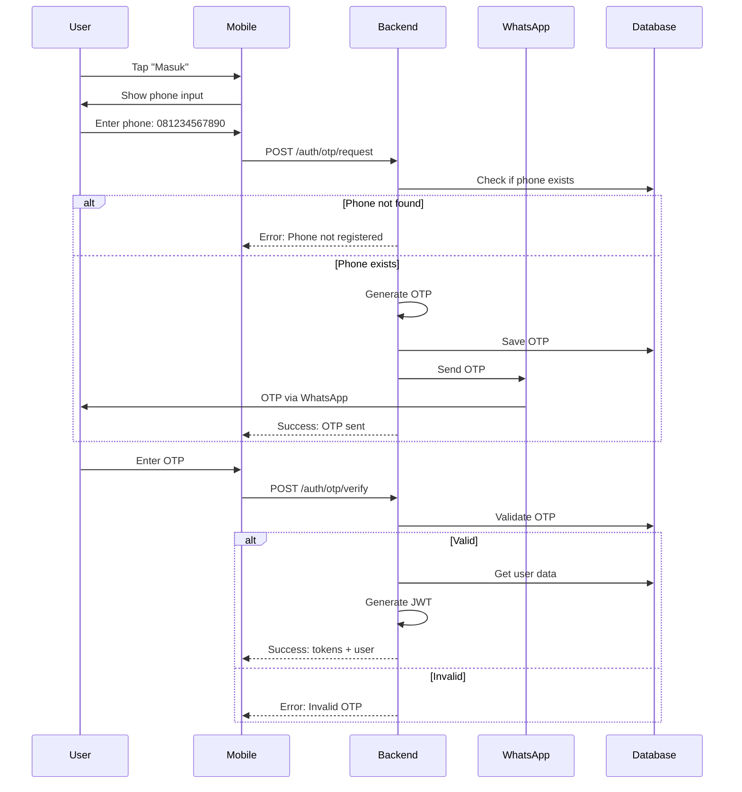

# 📱 OTP Authentication - WhatsApp/SMS Integration

> **Version**: 1.0.0  
> **Last Updated**: 2025-12-28  
> **Purpose**: OTP-based authentication untuk Parent & Kader (passwordless)

---

## 📋 Table of Contents

1. [Overview](#overview)
2. [Database Schema Updates](#database-schema-updates)
3. [OTP Flow Diagram](#otp-flow-diagram)
4. [Use Cases](#use-cases)
5. [WhatsApp Integration](#whatsapp-integration)
6. [Security Considerations](#security-considerations)
7. [Implementation Guide](#implementation-guide)

---

## 🎯 Overview

### Why OTP for Parent & Kader?

✅ **No email requirement** - Parent & Kader mungkin tidak punya email  
✅ **WhatsApp familiar** - Semua orang di Indonesia punya WhatsApp  
✅ **No password to remember** - Simplified UX untuk non-tech users  
✅ **Secure** - OTP expires, single-use only

### Auth Method Strategy

| Role                      | Auth Method      | Reason                         |
| ------------------------- | ---------------- | ------------------------------ |
| **Parent**                | Phone + OTP      | Simplified, WhatsApp-based     |
| **Kader**                 | Phone + OTP      | Simplified, WhatsApp-based     |
| **Unit Admin**            | Email + Password | Professional users, need email |
| **Tenant Admin**          | Email + Password | Admin users, security          |
| **Village/District Head** | Email + Password | Government officials           |
| **Super Admin**           | Email + Password | Platform owners                |

---

## 🗄️ Database Schema Updates

### 1. Update `users` Table

Add phone number support:

```typescript
// src/db/schema/users.ts
export const users = pgTable("users", {
    // ... existing fields

    // Add these fields:
    phoneNumber: varchar("phone_number", { length: 20 }).unique(),
    authMethod: varchar("auth_method", { length: 20 })
        .notNull()
        .default("email"),
    // 'email' | 'phone'

    phoneVerified: boolean("phone_verified").default(false),

    // Make email nullable (karena phone users tidak perlu email)
    email: varchar("email", { length: 255 }), // Remove .notNull()

    // ... rest of fields
});
```

**Constraints**:

- Email unique per tenant (existing)
- Phone number globally unique (new)
- Either email OR phoneNumber must be present (application layer validation)

---

### 2. Create `otp_codes` Table

```typescript
// src/db/schema/otp-codes.ts
import { pgTable, uuid, varchar, timestamp, boolean, integer } from 'drizzle-orm/pg-core';

export const otpCodes = pgTable('otp_codes', {
  id: uuid('id').primaryKey().defaultRandom(),

  phoneNumber: varchar('phone_number', { length: 20 }).notNull(),

  otp: varchar('otp', { length: 6 }).notNull(), // 6-digit code

  purpose: varchar('purpose', { length: 50 }).notNull(), // 'login' | 'register' | 'verify'

  expiresAt: timestamp('expires_at').notNull(),

  verified: boolean('verified').notNull().default(false),

  attempts: integer('attempts').notNull().default(0), // Rate limiting

  ipAddress: varchar('ip_address', { length: 45 }),

  createdAt: timestamp('created_at').notNull().defaultNow(),
});

// Indexes
CREATE INDEX idx_otp_codes_phone ON otp_codes(phone_number);
CREATE INDEX idx_otp_codes_expires ON otp_codes(expires_at);
```

**Business Rules**:

- OTP expires dalam 5 menit
- Maximum 3 verification attempts per OTP
- Maximum 5 OTP requests per phone per hour (rate limiting)
- Auto-cleanup expired OTP > 24 jam (cron job)

---

## 🔄 OTP Flow Diagram

### Registration Flow (Phone-based)


### Login Flow (Existing User)



---

## 🎯 Use Cases

### 1. Request OTP Use Case

**File**: `src/modules/auth/application/use-cases/auth/request-otp.use-case.ts`

```typescript
import { IOtpRepository } from "@/modules/auth/domain/repositories/IOtpRepository";
import { IUserRepository } from "@/modules/auth/domain/repositories/IUserRepository";
import { IWhatsAppService } from "@/modules/auth/domain/services/IWhatsAppService";
import { PhoneNumber } from "@/modules/auth/domain/value-objects/PhoneNumber.vo";

export interface RequestOtpInput {
    phoneNumber: string;
    purpose: "login" | "register";
    ipAddress?: string;
}

export interface RequestOtpOutput {
    message: string;
    expiresIn: number; // seconds
}

export class RequestOtpUseCase {
    constructor(
        private userRepo: IUserRepository,
        private otpRepo: IOtpRepository,
        private whatsappService: IWhatsAppService
    ) {}

    async execute(input: RequestOtpInput): Promise<RequestOtpOutput> {
        // 1. Validate phone number
        const phone = new PhoneNumber(input.phoneNumber);

        // 2. Rate limiting check
        await this.checkRateLimit(phone.getValue(), input.ipAddress);

        // 3. Check if phone exists based on purpose
        const existingUser = await this.userRepo.findByPhoneNumber(phone);

        if (input.purpose === "register" && existingUser) {
            throw new PhoneAlreadyRegisteredError(phone.getValue());
        }

        if (input.purpose === "login" && !existingUser) {
            throw new PhoneNotRegisteredError(phone.getValue());
        }

        // 4. Generate OTP
        const otp = this.generateOtp(); // 6-digit random
        const expiresAt = new Date(Date.now() + 5 * 60 * 1000); // 5 minutes

        // 5. Save OTP to database
        await this.otpRepo.create({
            phoneNumber: phone.getValue(),
            otp: otp,
            purpose: input.purpose,
            expiresAt: expiresAt,
            ipAddress: input.ipAddress,
        });

        // 6. Send OTP via WhatsApp
        await this.whatsappService.sendOtp({
            phoneNumber: phone.getValue(),
            otp: otp,
            expiresIn: 5,
        });

        return {
            message: `OTP has been sent to ${phone.getMasked()}`,
            expiresIn: 300, // 5 minutes in seconds
        };
    }

    private generateOtp(): string {
        return Math.floor(100000 + Math.random() * 900000).toString();
    }

    private async checkRateLimit(
        phoneNumber: string,
        ipAddress?: string
    ): Promise<void> {
        // Check max 5 OTP requests per hour per phone
        const count = await this.otpRepo.countRecentRequests(phoneNumber, 60); // 60 minutes

        if (count >= 5) {
            throw new RateLimitExceededError(
                "Too many OTP requests. Please try again later."
            );
        }
    }
}
```

---

### 2. Verify OTP Use Case

**File**: `src/modules/auth/application/use-cases/auth/verify-otp.use-case.ts`

```typescript
export interface VerifyOtpInput {
    phoneNumber: string;
    otp: string;
    purpose: "login" | "register";
    // For register
    fullName?: string;
    tenantId?: string;
    role?: string;
}

export interface VerifyOtpOutput {
    accessToken: string;
    refreshToken: string;
    user: {
        id: string;
        phoneNumber: string;
        fullName: string;
        role: string;
        tenantId: string | null;
    };
}

export class VerifyOtpUseCase {
    constructor(
        private userRepo: IUserRepository,
        private otpRepo: IOtpRepository,
        private authProvider: IAuthProvider,
        private tokenService: TokenService,
        private refreshTokenRepo: IRefreshTokenRepository
    ) {}

    async execute(input: VerifyOtpInput): Promise<VerifyOtpOutput> {
        // 1. Validate phone
        const phone = new PhoneNumber(input.phoneNumber);

        // 2. Find OTP
        const otpRecord = await this.otpRepo.findLatestValid(
            phone.getValue(),
            input.purpose
        );

        if (!otpRecord) {
            throw new OtpNotFoundError(
                "No valid OTP found for this phone number"
            );
        }

        // 3. Check expired
        if (otpRecord.isExpired()) {
            throw new OtpExpiredError(
                "OTP has expired. Please request a new one."
            );
        }

        // 4. Check attempts
        if (otpRecord.attempts >= 3) {
            throw new TooManyAttemptsError(
                "Too many failed attempts. Please request a new OTP."
            );
        }

        // 5. Verify OTP
        if (otpRecord.otp !== input.otp) {
            await this.otpRepo.incrementAttempts(otpRecord.id);
            throw new InvalidOtpError("Invalid OTP code");
        }

        // 6. Mark OTP as verified
        await this.otpRepo.markAsVerified(otpRecord.id);

        // 7. Handle based on purpose
        let user;

        if (input.purpose === "register") {
            user = await this.registerUser(phone, input);
        } else {
            user = await this.userRepo.findByPhoneNumber(phone);
            if (!user) throw new UserNotFoundError(phone.getValue());
        }

        // 8. Check user active & tenant active (same as email login)
        if (!user.isActive) {
            throw new UnauthorizedError("Account is deactivated");
        }

        // 9. Generate tokens
        const accessToken = this.tokenService.generateAccessToken({
            userId: user.id.getValue(),
            phoneNumber: phone.getValue(),
            tenantId: user.tenantId?.getValue() ?? null,
            role: user.role.getValue(),
            permissions: user.permissions.map((p) => p.getValue()),
            scopeUnitId: user.scopeUnitId,
            scopeRegionId: user.scopeRegionId,
        });

        const refreshToken = this.tokenService.generateRefreshToken();
        const expiresAt = new Date(Date.now() + 30 * 24 * 60 * 60 * 1000);

        await this.refreshTokenRepo.create({
            userId: user.id.getValue(),
            token: refreshToken,
            expiresAt: expiresAt,
        });

        return {
            accessToken,
            refreshToken,
            user: {
                id: user.id.getValue(),
                phoneNumber: phone.getValue(),
                fullName: user.toObject().fullName,
                role: user.role.getValue(),
                tenantId: user.tenantId?.getValue() ?? null,
            },
        };
    }

    private async registerUser(phone: PhoneNumber, input: VerifyOtpInput) {
        // Create auth user in Supabase (phone-based)
        const authResult = await this.authProvider.signUpWithPhone(
            phone.getValue()
        );

        // Create user record
        return await this.userRepo.create({
            tenantId: input.tenantId ? new TenantId(input.tenantId) : null,
            supabaseAuthId: authResult.authUserId,
            phoneNumber: phone.getValue(),
            authMethod: "phone",
            fullName: input.fullName || "",
            role: input.role || "PARENT",
            phoneVerified: true,
        });
    }
}
```

---

## 📱 WhatsApp Integration

### Option 1: Fonnte API (Recommended untuk Indonesia)

**Setup**:

```bash
# Add to .env
FONNTE_API_KEY=your-fonnte-api-key
FONNTE_DEVICE_ID=your-device-id
```

**Implementation**:

**File**: `src/modules/auth/infrastructure/services/FonnteWhatsAppService.ts`

```typescript
export class FonnteWhatsAppService implements IWhatsAppService {
    private apiKey: string;
    private baseUrl = "https://api.fonnte.com";

    constructor(apiKey: string) {
        this.apiKey = apiKey;
    }

    async sendOtp(params: SendOtpParams): Promise<void> {
        const message = this.formatOtpMessage(params.otp, params.expiresIn);

        const response = await fetch(`${this.baseUrl}/send`, {
            method: "POST",
            headers: {
                Authorization: this.apiKey,
                "Content-Type": "application/json",
            },
            body: JSON.stringify({
                target: params.phoneNumber,
                message: message,
                countryCode: "62", // Indonesia
            }),
        });

        if (!response.ok) {
            throw new WhatsAppSendError("Failed to send OTP via WhatsApp");
        }
    }

    private formatOtpMessage(otp: string, expiresIn: number): string {
        return `
🔐 *Kode OTP Gizi Platform*

Kode OTP Anda: *${otp}*

Kode ini berlaku selama ${expiresIn} menit.
Jangan bagikan kode ini kepada siapa pun.

_Abaikan pesan ini jika Anda tidak merasa melakukan login._
    `.trim();
    }
}
```

---

### Option 2: Twilio SMS (Alternative)

```typescript
export class TwilioSmsService implements IWhatsAppService {
    private client: any; // Twilio client

    async sendOtp(params: SendOtpParams): Promise<void> {
        await this.client.messages.create({
            body: `Your Gizi OTP: ${params.otp}. Expires in ${params.expiresIn} minutes.`,
            from: process.env.TWILIO_PHONE_NUMBER,
            to: params.phoneNumber,
        });
    }
}
```

---

### Option 3: Supabase Phone Auth (Future)

Supabase punya built-in Phone Auth via Twilio:

```typescript
const { data, error } = await supabase.auth.signInWithOtp({
    phone: "+6281234567890",
});

// Verify
const { data, error } = await supabase.auth.verifyOtp({
    phone: "+6281234567890",
    token: "123456",
    type: "sms",
});
```

**Pros**: Managed, integrated  
**Cons**: Butuh Twilio account, cost per SMS

---

## 🔒 Security Considerations

### 1. OTP Security

✅ **DO**:

- Generate cryptographically secure random OTP
- Hash OTP before storing in database (optional, for extra security)
- Set expiry (5 minutes recommended)
- Limit verification attempts (3 max)
- Auto-delete after verification or expiry

❌ **DON'T**:

- Use predictable OTP (sequential, timestamp-based)
- Send OTP via SMS to international numbers (expensive & unreliable)
- Allow unlimited verification attempts

### 2. Rate Limiting

```typescript
// Prevent brute force
const rateLimits = {
    requestOtp: {
        maxRequests: 5,
        windowMinutes: 60,
    },
    verifyOtp: {
        maxAttempts: 3,
        perOtp: true,
    },
};
```

### 3. Phone Number Validation

```typescript
// Value Object: PhoneNumber
export class PhoneNumber {
    private readonly value: string;

    constructor(phoneNumber: string) {
        this.value = this.validate(phoneNumber);
    }

    private validate(phone: string): string {
        // Remove all non-digit characters
        const cleaned = phone.replace(/\D/g, "");

        // Indonesian phone numbers
        // Format: 08xx-xxxx-xxxx (10-13 digits after 0)
        // Or: +62-8xx-xxxx-xxxx

        let normalized = cleaned;

        // Convert +62 to 0
        if (normalized.startsWith("62")) {
            normalized = "0" + normalized.substring(2);
        }

        // Must start with 08
        if (!normalized.startsWith("08")) {
            throw new InvalidPhoneNumberError(
                "Phone number must start with 08"
            );
        }

        // Length check (10-13 digits)
        if (normalized.length < 10 || normalized.length > 13) {
            throw new InvalidPhoneNumberError("Invalid phone number length");
        }

        return normalized;
    }

    getValue(): string {
        return this.value;
    }

    // For WhatsApp API (format: 62xxx without +)
    getInternationalFormat(): string {
        return "62" + this.value.substring(1);
    }

    // For display (masked: 0812****5678)
    getMasked(): string {
        const first4 = this.value.substring(0, 4);
        const last4 = this.value.substring(this.value.length - 4);
        return `${first4}****${last4}`;
    }
}
```

---

## 🧪 Testing Checklist

### Unit Tests

- [ ] PhoneNumber value object validation
- [ ] OTP generation (6-digit, random)
- [ ] RequestOtpUseCase - rate limiting
- [ ] VerifyOtpUseCase - invalid OTP, expired, too many attempts

### Integration Tests

- [ ] Request OTP → OTP saved in database
- [ ] Verify valid OTP → User created & JWT returned
- [ ] Verify expired OTP → Error
- [ ] Verify with wrong OTP 3x → Error
- [ ] Request OTP 6x in 1 hour → Rate limit error

### Manual Tests (with real WhatsApp)

- [ ] Register dengan phone baru → Receive OTP via WhatsApp
- [ ] Login dengan phone existing → Receive OTP
- [ ] OTP expires after 5 minutes
- [ ] Cannot reuse OTP after verification

---

## 🚀 Migration Path

### For Existing Email Users

If user already has email + password, allow adding phone number:

```typescript
// AddPhoneNumberUseCase
async execute(userId: string, phoneNumber: string) {
  // 1. Send OTP to verify phone ownership
  // 2. After verification, update user record
  await this.userRepo.update(userId, {
    phoneNumber: phoneNumber,
    phoneVerified: true,
  });

  // 3. User can now login dengan email OR phone
}
```

---

## ✅ Implementation Checklist

### Database

- [ ] Add `phoneNumber`, `authMethod`, `phoneVerified` to `users` table
- [ ] Create `otp_codes` table
- [ ] Create indexes
- [ ] Run migration

### Domain Layer

- [ ] Create `PhoneNumber` value object
- [ ] Update `User` entity support phone-based auth
- [ ] Create `IOtpRepository` interface
- [ ] Create `IWhatsAppService` interface
- [ ] Add OTP-related errors

### Application Layer

- [ ] Implement `RequestOtpUseCase`
- [ ] Implement `VerifyOtpUseCase`
- [ ] Implement `ResendOtpUseCase`
- [ ] Create DTOs

### Infrastructure Layer

- [ ] Implement `OtpRepository` (Drizzle)
- [ ] Implement `FonnteWhatsAppService` atau `TwilioSmsService`
- [ ] Update `SupabaseAuthProvider` support phone auth

### Interface Layer

- [ ] Create `POST /auth/otp/request` endpoint
- [ ] Create `POST /auth/otp/verify` endpoint
- [ ] Create `POST /auth/otp/resend` endpoint
- [ ] Add validation middleware (Zod schemas)

---

**Next**: Implement OTP authentication in Infrastructure, Application, and Interface layers!
